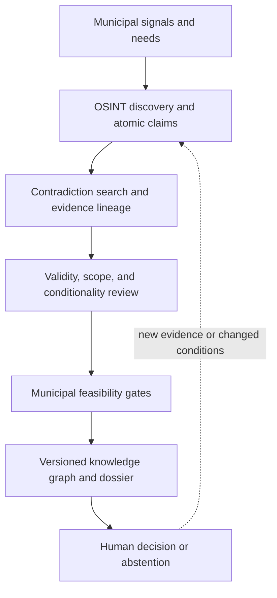

# Georgia Tech SDLinks Fall 2026 Practicum

> **Verification-first analytics for connecting municipal sustainability needs with credible, context-appropriate solutions.**

[](https://pe.gatech.edu/degrees/analytics)
[](#practicum-at-a-glance)
[](#project-status)
[](https://sdgs.un.org/goals)

This organization is the collaborative engineering workspace for the **Georgia Tech SDLinks Fall 2026 Practicum**. Seventeen graduate analytics students, organized into six teams, are developing interoperable research prototypes for **SDLinks**, the flagship research-to-operations program incubated by **Everything Lives LLC**.

SDLinks asks a deceptively simple question:

> How can a municipality find a sustainability solution that appears promising, determine what the available evidence actually supports, and understand whether that solution is feasible in its own place and time?

The practicum approaches that question as an evidence-engineering problem. It combines open-source intelligence, claim-level provenance, skeptical corroboration, municipal feasibility analysis, knowledge graphs, temporal reasoning, and explainable decision support. The goal is not an automated procurement system. The goal is a reproducible way to move from scattered public information to a bounded, reviewable recommendation without silently converting publicity, repetition, similarity, or model confidence into truth.

## The short version

This page is the public front door for a private, university-based applied analytics project.

- **Georgia Tech** provides the graduate practicum setting in which student teams tackle a real customer problem.
- **Everything Lives LLC** is the practicum customer. It proposed the work, assembled and governs the launch data, defines the research and safety boundaries, and receives the student handoffs.
- **Dr. Newton H. Campbell Jr.** is the principal investigator, technical customer, project mentor, and data steward.
- **SDLinks**, short for Sustainable Development Links, is the larger applied research program that the practicum advances.
- **VALID**, short for Verified Alignment for Local Infrastructure Decisions, is the evidence-to-match workflow under investigation.
- **The six student teams** each go deeply into one hard technical question while still proving a complete, inspectable path through the wider system.

The repositories are private because they contain student work in progress, controlled evaluation materials, governed data, and named-organization research that has not been cleared for public release. This README gives an external reader the program context without exposing those materials.

> [!IMPORTANT]
> **Team members:** Begin in your assigned private repository. Open the definitive Getting Started guide linked at the top of that repository's README before changing code or data. That guide governs your team's scope, milestones, guardrails, deliverables, and validation expectations.

## Contents

- [Why SDLinks exists](#why-sdlinks-exists)
- [What SDLinks is](#what-sdlinks-is)
- [Practicum at a glance](#practicum-at-a-glance)
- [Who is Everything Lives?](#who-is-everything-lives)
- [Who is Newton Campbell?](#who-is-newton-campbell)
- [How the proposal became this practicum](#how-the-proposal-became-this-practicum)
- [The end-to-end research problem](#the-end-to-end-research-problem)
- [Three program areas](#three-program-areas)
- [Six team investigations](#six-team-investigations)
- [VALID: the verification spine](#valid-the-verification-spine)
- [Evidence, claims, and dispositions](#evidence-claims-and-dispositions)
- [Time is part of the evidence](#time-is-part-of-the-evidence)
- [Municipality-solution matchmaking](#municipality-solution-matchmaking)
- [Knowledge-graph model](#knowledge-graph-model)
- [OSINT lanes and data lifecycle](#osint-lanes-and-data-lifecycle)
- [The launch data foundation](#the-launch-data-foundation)
- [Prototype architecture](#prototype-architecture)
- [Evaluation strategy](#evaluation-strategy)
- [Shared steel thread](#shared-steel-thread)
- [Expected outputs](#expected-outputs)
- [Repository and collaboration model](#repository-and-collaboration-model)
- [Engineering standards](#engineering-standards)
- [Responsible research and AI use](#responsible-research-and-ai-use)
- [What success looks like](#what-success-looks-like)
- [Project status](#project-status)
- [Frequently asked questions](#frequently-asked-questions)
- [Leadership and acknowledgement](#leadership-and-acknowledgement)

## Why SDLinks exists

Municipalities make decisions that shape transport, buildings, food systems, water, waste, energy, resilience, public health, communications, and land use. Many of the technologies that could help already exist. The information needed to evaluate them also exists, at least in fragments. It appears in procurement notices, council minutes, budget documents, Voluntary Local Reviews, vendor publications, government reports, standards, registries, research papers, deployment case studies, and institutional datasets.

The hard problem is not merely finding documents. The hard problem is deciding what those documents mean together.

A vendor may describe a successful deployment without naming the operating conditions. A municipality may publish a need in language that does not resemble a technology catalogue. Ten websites may repeat one press release and create the illusion of ten independent sources. A solution may have worked in one jurisdiction but fail another jurisdiction's regulatory, physical, financial, or institutional constraints. An evidence-backed match may be valid in April and stale by October. A polished model can score every candidate while remaining unable to say which source passage supports the score.

SDLinks treats these failures as first-class engineering concerns:

- **Discovery failure:** relevant public evidence is never found.
- **Granularity failure:** a long document is treated as evidence for a claim that appears nowhere in it.
- **Lineage failure:** copied or syndicated text is mistaken for independent corroboration.
- **Contradiction failure:** retrieval favors supporting evidence and never performs a serious search for disconfirming evidence.
- **Scope failure:** a statement about a pilot, product family, region, or time period is generalized beyond its valid boundary.
- **Conditionality failure:** caveats and operating conditions disappear during extraction or summarization.
- **Feasibility failure:** a strong technology claim is mistaken for a good municipal match.
- **Temporal failure:** a once-valid source, requirement, deployment, or match remains promoted after the world changes.
- **Automation failure:** a score, embedding, graph edge, or geometric pattern becomes a verdict without evidence and review.

The practicum is building methods that make those failure modes visible, measurable, and difficult to ignore.

## What SDLinks is

SDLinks is a **knowledge-graph-centered research and engineering framework** for linking local sustainability needs with globally available capabilities. Its intended contribution is an auditable chain from a municipal signal to a candidate solution, through evidence review and feasibility analysis, to an explanation a human analyst can inspect.

SDLinks is:

- a verification-first OSINT pipeline;
- a claim and evidence engineering framework;
- an explainable municipality-to-solution matchmaking system;
- a research platform for knowledge graphs, retrieval, verification, and decision support;
- a way to compare municipalities with structurally relevant peers rather than abstract averages;
- a foundation for public-interest infrastructure intelligence; and
- a long-term consortium concept spanning academia, government, civil society, and industry.

SDLinks is not:

- a vendor marketplace;
- an autonomous procurement engine;
- a certification authority;
- a system that declares a technology, company, or municipality "good" or "bad";
- a replacement for engineering, legal, regulatory, financial, environmental, or community review;
- a mechanism for collecting restricted or sensitive municipal data; or
- a claim that model confidence, citation count, or geometric coherence equals truth.

The intended decision-support pattern is:

**municipal need → candidate capability → atomic claims → traceable evidence → skeptical corroboration → local feasibility → time-bounded match → human-reviewable dossier**

## Practicum at a glance

| Dimension | Fall 2026 program |
| --- | --- |
| Academic setting | Georgia Institute of Technology graduate analytics practicum |
| Project | SDLinks: Sustainable Development Links |
| Sponsor and research lead | Everything Lives LLC, led by Dr. Newton Campbell Jr. |
| Cohort | 17 graduate students |
| Team structure | Six private team repositories with distinct, interoperable research assignments |
| Primary areas | OSINT Discovery and Claim/Evidence Engineering; Applied Skeptical Corroboration; Municipality Feasibility and Knowledge-Graph Integration |
| Shared system objective | A traceable due-diligence steel thread connecting at least two municipalities with candidate solutions and reviewable evidence |
| Verification posture | `CORROBORATED`, `CONTRADICTED`, or `NOT_ENOUGH_INFORMATION`, with explicit abstention and human escalation |
| Core design values | provenance, reproducibility, bounded claims, temporal validity, explainability, interoperability, and responsible human review |
| Repository visibility | Team repositories are private; this profile provides the public program overview |
| Maturity | Research and prototype infrastructure, not a production service |

## Who is Everything Lives?

**Everything Lives LLC** is an independent AI, space, data, and public-interest technology consultancy based in Washington, DC. It develops research, prototypes, and decision-support methods for difficult problems that cross institutional and disciplinary boundaries.

Its work brings together fields that are often separated in practice:

- artificial intelligence and machine learning;
- open-source intelligence and evidence verification;
- knowledge graphs and data engineering;
- aerospace and space-derived technology;
- public-sector decision support;
- sustainable development;
- responsible AI and governance; and
- research translation across government, universities, civil society, and industry.

Everything Lives is the incubator and practicum customer for SDLinks. That means the company is responsible for framing the real-world need, defining the initial concept of operations, assembling and governing the research snapshot, setting the acceptance and safety constraints, mentoring the teams, and deciding whether later work is suitable for integration or public release.

SDLinks should be understood as an **emerging, incubated initiative**. The existence of this practicum does not imply that SDLinks is a deployed public service, a funded procurement program, a formal international organization, or an endorsed product of every institution whose public data or research informs it.

## Who is Newton Campbell?

**Dr. Newton H. Campbell Jr.** is the founder and principal of Everything Lives LLC and the principal investigator behind SDLinks. In this practicum, he serves as the technical customer, project mentor, and data steward. He defines the customer problem and research boundaries, supplies the governed starting materials, reviews evidence and integration decisions, and receives the final continuation packages.

Campbell is an artificial-intelligence and space-systems researcher whose work focuses on dependable AI, autonomy, knowledge systems, public-interest technology, and sustainable development. His professional work has included senior AI research for NASA, technical contributions to the United Nations Early Warnings for All effort, university teaching and advising, aerospace autonomy research, and service on the Board of Directors of The Planetary Society. He was named to the [2026 TIME100 AI list](https://time.com/collection/time100-ai/2026/newton-campbell-jr/). Public biographies are also available from [The Planetary Society](https://www.planetary.org/profiles/newton-campbell-jr/), [AI for Good](https://aiforgood.itu.int/speaker/newton-campbell-jr/), and the [Atlantic Council](https://www.atlanticcouncil.org/expert/newton-campbell/).

His connection to Georgia Tech's analytics practicums predates SDLinks. The Fall 2026 proposal builds on several earlier practicum collaborations involving campaign-finance analytics, social-network analysis, aerospace and environmental research, and explainable analytics. Those experiences shaped the emphasis here on real customer needs, visible intermediate artifacts, empirical evaluation, clear handoffs, and work another team can continue.

The biography above explains why this project crosses space technology, AI verification, municipal infrastructure, and sustainable development. It does not imply that NASA, the United Nations, The Planetary Society, TIME, or any other organization endorses this practicum or its results.

## How the proposal became this practicum

Everything Lives submitted **“SDLinks: Verification-Engine Analytics and Knowledge-Graph Analytics for Space-Tech Markets”** to the Georgia Tech MS Analytics Practicum on May 15, 2026.

The proposal joined two problems that are usually handled separately.

First, public decision-makers face an expanding volume of sustainability and performance claims. Modern generative tools can produce long, internally consistent disclosures faster than a procurement or policy team can verify them. Reviewers may then fall back on brand recognition, familiar advisers, citation counts, or surface plausibility.

Second, municipalities may not know which capabilities from the commercial space, aerospace, geospatial, robotics, life-support, computing, or advanced-technology sectors could address a documented local need. Technology organizations may also struggle to see municipal demand expressed across plans, budgets, tenders, council records, and development reports.

The proposed answer was VALID: a pipeline that decomposed claims, retrieved public evidence, assigned calibrated dispositions, applied physical and economic plausibility checks, and predicted capability-to-need links in a multiplex knowledge graph.

### The six capabilities in the May proposal

| Proposed capability | Original analytical purpose | Where it appears in the launched program |
| --- | --- | --- |
| Claim decomposition | Split long or compound vendor statements into atomic, assessable propositions | Team 6 evidence intake and all teams' shared claim contract |
| OSINT evidence retrieval | Retrieve claim-specific supporting, contradicting, and contextual public evidence | Teams 2 and 6, with bounded search and root-lineage controls |
| Claim verification | Produce calibrated supported, contradicted, or insufficient-evidence outcomes | Teams 1–3, using stricter canonical assessment semantics |
| Physical-constraint plausibility | Compare numerical claims with sector and contextual priors to flag implausibility | VALID experiments, feasibility gates, and contextual evidence; priors never replace claim evidence |
| Knowledge-graph link prediction | Rank potential capability-to-need edges between technology organizations and municipalities | Teams 4 and 5, with directed matches, noncompensable gates, provenance, and time |
| Built-environment signal fusion | Test whether place-based indicators improve match quality | Retained as a possible extension, subject to data rights, partner access, and a decision gate |

The accepted project was then refined through the launch brief, data and provenance handbook, research and evaluation guide, launch presentation, verification-engine design, data collection plan, and six definitive team guides.

### What changed between proposal and launch

| May proposal framing | Fall launch control | Why the refinement matters |
| --- | --- | --- |
| One 4–6 person implementation team | Seventeen students in six teams of two or three | Allows six deeper research investigations while preserving a common integration target |
| A centrally described six-capability pipeline | Three program areas and six team-specific research questions | Gives each team a falsifiable contribution rather than a generic platform backlog |
| “Supported / contradicted / not enough information” | `CORROBORATED`, `CONTRADICTED`, or `NOT_ENOUGH_INFORMATION`; assessability, conditionality, and routing remain separate | Prevents workflow states and narrower findings from becoming accidental fourth verdict classes |
| A curated dataset described as pre-staged | Incremental, versioned snapshots with explicit QA and no silent mixing | Keeps promises aligned with the evidence actually collected and governed at each date |
| Ranked municipality–capability matches | Directed `Capability → Need` CandidateMatches with municipal gate ledgers | Prevents an attractive rank from compensating for a failed or unknown critical requirement |
| Knowledge-graph links | Reified, versioned, time-aware relationships with provenance and RunVersion | Lets analysts reconstruct what was known, what was valid, and why a result changed |
| Procurement-oriented intelligence | Research triage and due-diligence support only | Avoids implying certification, endorsement, procurement advice, or misconduct findings |
| Demonstrate the pipeline | First prove two small, inspectable municipality paths; then automate measured stages | Forces integration and semantic clarity before sophistication |

This history matters because the launch materials do not abandon the proposal. They make it testable. They turn broad capabilities into explicit records, controls, handoffs, failure states, and research questions.

## The end-to-end research problem

The practicum studies the whole decision chain while dividing ownership across focused teams.



Every arrow represents a contract between research components. Those contracts need stable identifiers, defined schemas, preserved evidence passages, version history, and explicit uncertainty. One team may improve retrieval. Another may improve closure tests. A third may model feasibility. Their outputs become useful together only if the meaning of each field survives the handoff.

The system must therefore answer two kinds of questions at once:

1. **Substantive questions:** What does the evidence support? Is the proposed solution feasible for this municipality under current conditions?
2. **Systems questions:** Can another analyst reproduce the result? Can another component consume it? Can the system explain why a status changed?

## Three program areas

### 1. OSINT Discovery and Claim/Evidence Engineering

This area turns public information into evidence objects that downstream systems can use without losing source meaning. It covers bounded source discovery, acquisition, document identity, text extraction, OCR where permitted, passage selection, atomic claim creation, metadata, rights-aware storage, and transformation lineage.

The central challenge is disciplined granularity. A source document is not automatically evidence for every proposition associated with it. Evidence must point to the passage that bears on the claim. An extracted claim must retain its subject, predicate, object or value, qualifiers, units, location, time, source, extraction method, and uncertainty.

### 2. Applied Skeptical Corroboration

This area asks whether a claim survives a deliberately skeptical search. It separates vendor-authored material from independent or institutional evidence. It traces repeated statements to their earliest identifiable root. It searches for contradictions, limitations, failed deployments, scope mismatches, changed product specifications, and evidence that is merely adjacent to the claim.

The goal is calibrated disposition, not aggressive acceptance or rejection. A system that labels every claim unsupported is safe but useless. A system that rewards repeated publicity is useful-looking but unsafe. The research target is selective, evidence-based judgment with an honest abstention path.

### 3. Municipality Feasibility and Knowledge-Graph Integration

This area asks whether a supported capability is appropriate for a particular municipality. Feasibility depends on local requirements and constraints. These may include climate, scale, infrastructure, interoperability, regulation, procurement rules, financing, workforce capacity, governance, maintenance, data availability, community priorities, and timing.

The knowledge graph must preserve the reason a match exists, the conditions under which it was promoted, and the evidence version used. It must also make changed conditions discoverable. A match is not a timeless edge. It is a versioned analytic conclusion with a validity interval, dependencies, and review state.

## Six team investigations

Each team owns a bounded investigation and an evaluation strategy. The questions below provide the public research framing. The definitive assignment in each private repository controls the team's detailed scope.

| Team investigation | Public research question | Primary contribution |
| --- | --- | --- |
| **Validity-Basis Closure and Deterministic Assessment** | Can explicit, predeclared closure checks reduce false corroboration without turning uncertainty into contradiction? | Formal-context representation, validity-basis selection, closure behavior, deterministic assessment, promotion invariants, and adversarial deletion tests |
| **Contradiction Retrieval and Root-Lineage Independence** | Does lineage-aware, contradiction-directed retrieval reduce circular corroboration within a fixed analyst-review budget? | Separate support and contradiction searches, source-family clustering, provisional information roots, independence judgments, review-budget analysis, and contradiction-search yield |
| **Scope Fidelity, Conditionality, and Human-Review Routing** | Can structured scope differences and selective routing raise useful automatic coverage under a predeclared false-corroboration ceiling? | Scope fidelity, conditional findings, disposition/modifier separation, selective prediction, abstention, review-capacity design, and routing rules |
| **Municipality Feasibility Gates and Constrained Promotion** | Can a versioned, noncompensable gate ledger detect and block invalid promotion under controlled evidence deletion, gate-state mutation, and scope mismatch without treating every candidate as infeasible? | Critical municipal gates, requirement provenance, `GATE_COMPLETE` versus `RESEARCH_ONLY`, mutation tests, and feasible-candidate coverage |
| **Versioned Knowledge Graphs, Competency Questions, and Robustness** | Can a time-aware, versioned knowledge graph answer practical questions about a vendor–municipality match, identify when changes in evidence, municipal needs, vendor capabilities, or feasibility conditions require renewed investigation, and explain why the match's eligibility for customer review changed or remained the same? | Bitemporal graph modeling, competency questions, `REVIEW_DUE`, query invariance, change detection, promotion lineage, and perturbation resistance |
| **Bounded OSINT and Investigation-Ready Evidence** | Which source, access, semantic, and temporal characteristics explain variation in the discoverability, evidentiary yield, and comparability of public information about local-government needs, business capability claims, and independent corroborating evidence? | Declared search boxes and budgets, attempted-source logs, passage and claim contracts, provisional lineage, temporal discovery analysis, provenance closure, and investigation-ready evidence packages |

These investigations are intentionally connected. Discovery quality limits corroboration quality. Corroboration quality limits feasibility analysis. Feasibility and graph modeling determine whether a result remains interpretable after integration. Versioning and temporal reasoning cut across all six.

Team 6 also asks a secondary question: **Which bounded collection strategies continue to perform across source classes, jurisdictions, formats, vocabularies, languages, and publication cycles when standardized reporting frameworks and existing bulk-ingestion pipelines are withheld?** This makes collection difficulty part of the research result rather than invisible preprocessing.

## VALID: the verification spine

The practicum's verification work is organized around **VALID**, an evolving verification-engine research concept for testing whether a claim or proposed match has a defensible basis. VALID combines order-theoretic structure, evidence rules, contextual constraints, and empirical evaluation. It is a research framework, not a certification label.

Two mathematical objects must remain separate:

1. An **FCA concept lattice** organizes formal concepts and auditable comparability regimes. Formal Concept Analysis helps expose which evidence attributes are shared, which implications hold under a defined context, and whether a proposed validity basis is closed.
2. A context-conditioned affine **Euclidean lattice** is an exploratory method for measuring geometric coherence within an eligible regime. It can produce an off-subspace residual and a within-subspace lattice residual.

The second object does not prove the first. A point near a learned lattice is not true because it is near the lattice. Geometric coherence is a versioned analytic observation that may support anomaly detection, structure discovery, or prioritization. Claim disposition remains grounded in traceable evidence, applicable scope, and defined decision rules.

The working conceptual hypothesis is that consistently represented claims may occupy a lower-dimensional, constraint-aligned region of a larger embedding space. That hypothesis must be tested against failure modes and matched alternatives. It cannot be assumed from a visually pleasing projection.

VALID prototypes therefore emphasize:

- explicit validity bases;
- closure and consistency checks;
- claim-specific evidence requirements;
- contradiction search;
- comparability regimes;
- constraint-aware eligibility;
- exact provenance;
- deterministic promotion rules where possible;
- abstention when evidence is insufficient;
- human review for consequential uncertainty; and
- falsification tests that try to make an apparently successful method fail.

## Evidence, claims, and dispositions

### Atomic claims

A claim should express one testable proposition at the narrowest useful scope. Compound marketing language should be decomposed before verification. A claim record may need:

| Field group | Examples |
| --- | --- |
| Identity | claim ID, version ID, parent claim, extraction run |
| Proposition | subject, predicate, object or value, polarity |
| Measurement | number, unit, tolerance, denominator, baseline |
| Scope | product, deployment, population, geography, jurisdiction, scale |
| Conditions | operating environment, prerequisites, exclusions, caveats |
| Time | event time, publication time, observed time, valid-from, valid-to |
| Source | document ID, canonical URL, publisher, author, root lineage |
| Evidence | exact passage, page or section, byte or character offsets where possible |
| Process | extraction method, model/tool version, reviewer, review state |
| Uncertainty | confidence, missing fields, ambiguity type, escalation reason |

### Evidence records

An evidence record is more than a URL. It should preserve enough context to let a reviewer understand what was observed and enough lineage to let an engineer reproduce the transformation.

Evidence provenance may include:

- canonical and retrieved URLs;
- publisher and publication type;
- retrieval timestamp;
- content hash or rights-aware link-only record;
- exact text span and document location;
- document language and translation status;
- OCR or extraction method;
- transformation parents;
- duplicate and source-family relationships;
- independence assessment;
- temporal scope;
- access outcome and limitations; and
- reviewer annotations with version history.

### Canonical dispositions

The default verification vocabulary is deliberately small:

| Disposition | Meaning |
| --- | --- |
| `CORROBORATED` | The required evidence supports the bounded claim under its stated scope and conditions. |
| `CONTRADICTED` | Material evidence conflicts with the bounded claim or a required part of it. |
| `NOT_ENOUGH_INFORMATION` | Available evidence cannot support a responsible determination. This is not contradiction and is not a weak rejection. |

The handbook keeps several other concepts separate from those three scored classes:

| Concept | Correct role |
| --- | --- |
| `NOT_ASSESSABLE_AS_WRITTEN` | A pre-scoring exclusion when a statement is not testable without changing its meaning |
| `CONDITIONAL` | A modifier attached only when a narrower corroborated scope closes; it is not a fourth disposition |
| `ABSTAIN` | A system routing action |
| `HUMAN_REVIEW_REQUIRED` | A system routing action tied to a declared review rule and capacity |
| `DISPUTED_PENDING_ADJUDICATION` | A human-reference workflow state, excluded from scored model metrics but retained in coverage reporting |
| `REVIEW_DUE` | A temporal investigation state; it does not itself say that a capability is infeasible or a prior decision was wrong |

Implementations may add states such as `UNREVIEWED`, `SUPERSEDED`, or `STALE`. Those states must not blur the meaning of the three evidence dispositions.

### Evidence is claim-specific

Evidence can be authoritative yet irrelevant. A government report about a technology class does not necessarily corroborate a vendor's product-specific performance claim. A peer-reviewed study may establish physical plausibility without establishing deployment history. A municipal press release may establish that a pilot occurred without establishing the advertised outcome.

The validity basis must state what kind of evidence is required for the claim at hand. The system should record why a source is considered applicable, not merely that the source has institutional prestige.

“Official” and “independent” are separate axes. An official source may repeat a claimant's assertion. An independent source may use an inapplicable test. Repetition does not close a validity basis, and absence of evidence does not by itself establish contradiction.

## Time is part of the evidence

Municipal needs, solicitations, budgets, regulations, product capabilities, deployments, organizations, and source pages all change. SDLinks therefore treats time as part of identity and validity rather than decorative metadata.

At minimum, a robust record should distinguish:

- **event time:** when the described deployment, decision, measurement, or condition occurred;
- **publication time:** when the source was issued;
- **observed time:** when the collection system saw the information;
- **retrieval time:** when the artifact was acquired;
- **valid-from and valid-to:** when a claim, requirement, relationship, or decision is understood to apply;
- **transaction time:** when the graph or database recorded the assertion; and
- **supersession time:** when a newer record replaced, narrowed, or invalidated an older one.

A match should be reinvestigated when a dependency changes. Triggers may include:

- a municipal requirement is added, removed, or materially revised;
- a procurement or funding window closes;
- a product version or vendor identity changes;
- a corroborating source is corrected, withdrawn, or superseded;
- a deployment passes beyond a defined freshness threshold;
- a regulation, standard, tariff, or eligibility rule changes;
- a gate changes from satisfied to unknown or failed;
- new counterevidence enters the graph;
- root-lineage analysis reveals that presumed independent sources share one origin; or
- a promoted relationship no longer reproduces under the recorded evidence version.

Temporal quality is measurable. Candidate measures include change-detection latency, stale-edge rate, correct interval overlap, temporal query accuracy, false reinvestigation rate, and time-to-review after a material dependency change.

The key rule is simple: **a match that was right once is not right forever merely because nobody revisited it.**

## Municipality-solution matchmaking

Verification of a technology claim and feasibility of a municipal match are different judgments.

A technology may be well supported but unsuitable for a municipality because it fails a local requirement. A technology may be feasible in principle but lack adequate evidence for a promoted recommendation. Matchmaking must preserve both sides.

### Need representation

A municipal need should retain:

- the municipality and responsible jurisdiction;
- the source and exact need statement;
- the relevant SDG targets or local policy objectives;
- affected population, service area, or infrastructure;
- scale, unit, baseline, and desired outcome;
- physical and environmental conditions;
- implementation horizon and procurement timing;
- budget or financing conditions when public;
- legal and regulatory constraints;
- institutional capacity and ownership;
- data, interoperability, and maintenance requirements;
- community, equity, accessibility, and language considerations; and
- uncertainty or missing information.

### Candidate capability representation

A candidate solution should distinguish the company, product, capability, deployment, and claim. These are not interchangeable entities. A parent company's experience does not automatically transfer to every subsidiary or product. A product-family claim does not automatically apply to a specific configuration. A pilot is not a commercial deployment unless the evidence supports that description.

### Noncompensable feasibility gates

Some municipal requirements are gates, not preferences. A high score elsewhere must not compensate for a failed legal requirement, incompatible operating range, missing certification, unacceptable infrastructure dependency, or deadline that cannot be met.

A gate ledger should record:

- gate ID and requirement version;
- whether the gate is mandatory or advisory;
- source and exact requirement passage;
- evaluation rule and evidence needed;
- state: `satisfied`, `failed`, `unknown`, or `not_applicable`;
- evaluator and method;
- effective interval;
- dependencies and superseding records; and
- effect on promotion.

Promotion should fail closed when a mandatory gate is failed. An unknown mandatory gate should route the candidate to abstention or human review according to the defined policy. Tests should delete evidence, mutate gate states, alter scopes, and advance time to ensure the result changes when it should.

### From match score to match dossier

SDLinks favors a dossier over a single opaque rank. A useful dossier should tell an analyst:

1. what need was identified and where it came from;
2. which capability may address it;
3. which claims matter to the proposed match;
4. which evidence supports, contradicts, or fails to resolve those claims;
5. whether evidence sources are independent;
6. which feasibility gates were applied;
7. what remains unknown;
8. when the conclusion is valid;
9. what event should trigger reinvestigation; and
10. why the system recommends promotion, rejection, abstention, or human review.

## Knowledge-graph model

The graph is an evidence and decision-lineage structure. It should not flatten a document, claim, organization, technology, need, and analyst judgment into one generic node.

### Representative entities

| Entity | Purpose |
| --- | --- |
| Municipality | The local government or governed place expressing needs and constraints |
| Jurisdiction | The legal or administrative context relevant to requirements |
| Need | A bounded, sourced municipal problem or desired outcome |
| SDG target | A structured connection to the UN Sustainable Development Goals |
| Organization | Vendor, institution, agency, university, funder, or publisher |
| Product | A named implementation offered by an organization |
| Capability | The functional or technical ability relevant to a need |
| Deployment | A time- and place-specific use of a product or capability |
| Claim | An atomic proposition requiring evaluation |
| Evidence passage | The exact source segment bearing on a claim |
| Source artifact | Document, webpage, dataset, record, transcript, or filing |
| Requirement | A sourced municipal condition or constraint |
| Feasibility gate | A rule that evaluates a candidate against a requirement |
| Match assessment | A versioned analytic relationship between a need and a capability |
| Review event | A human or automated action that changes workflow state |

### Reified relationships

Important relationships need their own identity because they carry evidence, time, conditions, and provenance. Instead of storing only:

`Municipality — MATCHED_TO → Product`

the graph should represent a **Match Assessment** node or relationship object with:

- municipal need version;
- product/capability version;
- supporting and contradicting claim IDs;
- gate-ledger version;
- disposition and confidence;
- explanation;
- created-by and reviewed-by information;
- valid interval;
- transaction history;
- supersession links; and
- reinvestigation triggers.

This design lets an analyst ask not only "What matches?" but also:

- What matched on a given date?
- Which evidence version caused the promotion?
- Which source lineage supported the decision?
- What changed after the decision?
- Which matches depend on a requirement that was just revised?
- Which promoted candidates become indeterminate if one evidence family is removed?
- Can the system reproduce the prior answer from the prior graph version?

## OSINT lanes and data lifecycle

The broader SDLinks OSINT workspace uses distinct lanes to prevent category errors.

| Lane | Question answered | Typical public sources |
| --- | --- | --- |
| **A: City Signals** | What needs, priorities, constraints, and opportunities are municipalities expressing? | Voluntary Local Reviews, solicitations, budgets, capital plans, council materials, strategies, and public meetings |
| **B: Vendor Claims** | What does a vendor publicly claim, and how directly or repeatedly? | Vendor sites, technical documents, announcements, product pages, and attributable quotations |
| **C: Entity and Roster** | Which vendors, products, capabilities, aliases, parents, and subsidiaries exist? | Registries, catalogues, filings, institutional lists, and authoritative entity records |
| **D: Independent Evidence** | What independent or institutional material may corroborate or contradict a claim? | Government reports, research, standards, deployment records, technology-transfer sources, and evaluation studies |
| **E: Context and Ground Truth** | What contextual indicators and policy conditions describe a jurisdiction? | Public statistical, policy, governance, environmental, and development datasets |

These lanes describe source posture, not truth. A Lane D document still needs claim-specific applicability review. A vendor quotation inside an institutional document should keep the institutional artifact's identity while the quotation remains vendor-attributed.

### Bronze, silver, and gold

| Layer | Meaning | Key rule |
| --- | --- | --- |
| **Bronze** | Immutable source bytes when rights permit, or rights-aware metadata/link-only records, plus provenance sidecars | Preserve what was retrieved and how it was identified |
| **Silver** | Normalized, deduplicated, classified, and linked records | Retain bronze hashes, transformation parents, uncertainty, and source posture |
| **Gold** | Traced synthesis, graph assertions, evaluation views, and analyst-facing dossiers | Never erase source uncertainty or promote automation output to human adjudication |

Downloaded documents, web captures, OCR output, workbooks, databases, logs, browser profiles, tokens, and handoff archives do not belong in Git unless they are small, rights-cleared fixtures explicitly approved for version control.

## The launch data foundation

The students are not beginning with a clean application database. They are beginning with a dated research snapshot assembled through the SDLinks Data Expedition and its pre-practicum collection campaign.

The May proposal described nine intended datasets:

1. a verified-claim benchmark;
2. a vendor-disclosure corpus;
3. an OSINT source corpus;
4. a source-credibility graph;
5. Voluntary Local Review and pilot cases;
6. a space-technology knowledge graph;
7. physical and economic plausibility priors;
8. policy, funding, institutional, educational, and cultural context layers; and
9. an adversarial red-team set.

The August data plan made an important correction explicit. At the beginning of that collection campaign, the nine dataset specifications, schemas, collection instruments, and verified source map existed, but the collected record count was zero. The plan therefore replaced the fiction of an instantly complete corpus with an incremental program:

- **Wave 0:** bounded organizer-led bulk pulls and foundational public datasets;
- **Wave 1:** a focused human collection effort for judgment-heavy municipal, vendor, case, and evidence records; and
- **Wave 2:** curation, annotation, identity resolution, benchmark growth, graph construction, and corpus expansion.

The governing principle was: **v0 at kickoff, a controlled later snapshot after initial collection and QA, and a verified benchmark only when adjudication actually supports that description.** Aspirational targets must never be reported as achieved counts.

### Snapshot supplied at launch

The definitive team guides describe the launch snapshot as follows:

| Snapshot element | Dated starting state | Interpretation |
| --- | ---: | --- |
| Master manifest | 1,287 rows | Inventory rows, not accepted truth records |
| Workflow status | 1,231 `ready_for_qa`; 56 `draft` | Readiness states remain subject to review |
| Populated SHA fields | 761 | Hash coverage is substantial but incomplete |
| Human-accepted records | 0 | No workflow status silently becomes human acceptance |
| Lane A: municipal signals | 592 rows | Public expressions of need, plans, authority, funding, procurement, or operation |
| Lane B: vendor sources and provisional claims | 328 source rows; 576 provisional claims | Claimant assertions requiring decomposition and assessment |
| Lane C: entities and capabilities | 159 rows | A starting roster, not a canonical organization/capability table |
| Lane D: evidence and cases | 102 rows covering 44 cases | Candidate institutional or independent evidence roles |
| Lane E: context and priors | 106 rows; 97 populated SHA fields | Context that may guide checks but cannot replace claim-specific evidence |

These counts describe a **versioned launch snapshot**, not the current state of the broader SDLinks collection effort and not the number of verified claims, valid matches, or production graph edges. Known launch cleanup included rights decisions, unresolved mappings, identity resolution, incomplete root-lineage work, missing hashes, failed or zero-byte acquisitions, and unresolved case references.

Students must mount or copy the customer snapshot read-only. Proposed corrections belong in versioned deltas. The original snapshot, failed attempts, rejected records, and unresolved states remain available for audit.

## Evaluation strategy

The practicum evaluates methods as research contributions rather than judging success by a polished demonstration alone.

### Evaluation principles

- Define the unit of analysis before selecting metrics.
- Separate training, development, and test data.
- Prevent source-family and root-lineage leakage across evaluation splits.
- Keep each team's evaluation split under that team's ownership.
- Include positive controls, negative controls, adversarial perturbations, and realistic failure cases.
- Compare against simple, credible baselines.
- Report uncertainty and repeated-run dispersion where stochastic methods are used.
- Evaluate abstention, not just forced classifications.
- Preserve examples of failure and explain why they failed.
- Do not use live network collection as a merge smoke test.
- Do not claim generality from one municipality, vendor, claim family, or model.

### Representative measures

| Concern | Candidate measures |
| --- | --- |
| Discovery | source recall at a fixed review budget, unique relevant-source yield, time to first relevant source |
| Claim extraction | atomicity, exact-span precision/recall, qualifier retention, unit fidelity, scope fidelity |
| Provenance | provenance closure, resolvable source rate, hash coverage, transformation-parent completeness |
| Lineage | root-source accuracy, duplicate-family purity, false independence rate |
| Contradiction retrieval | contradiction-search yield, recall of material counterevidence, counterevidence rank |
| Verification | per-disposition precision/recall/F1, calibration, selective risk, coverage, abstention quality |
| Validity basis | closure correctness, minimal-basis stability, evidence-deletion sensitivity |
| Feasibility | gate accuracy, invalid-promotion rate, feasible-candidate coverage, mutation sensitivity |
| Knowledge graph | query correctness, constraint violations, referential integrity, provenance-preserving joins |
| Temporal behavior | interval accuracy, stale-edge rate, change-detection latency, correct reinvestigation rate |
| Human review | escalation precision, review burden, decision time, explanation completeness |
| Reproducibility | environment recreation, deterministic test rate, artifact manifest closure |

### Falsification and perturbation

A convincing prototype should withstand tests designed to expose brittle reasoning. Examples include:

- deleting a required evidence passage;
- replacing an independent source with a syndication copy;
- changing a unit while preserving the surrounding language;
- moving a deployment outside the claim's geography or validity interval;
- changing a mandatory municipal gate from satisfied to unknown;
- introducing a contradictory product version;
- merging two organizations with similar names;
- removing a graph edge needed to answer an analyst query;
- replaying a query against an older graph version;
- adding a dense or random geometric control that can mimic apparent structure; and
- testing a sheared or otherwise misspecified lattice that the estimator cannot recover.

If the result does not change after a material dependency is removed or mutated, the system may be producing confidence without dependence on evidence.

## Shared steel thread

The shared acceptance target begins with a deliberately constrained end-to-end demonstration involving two municipalities. The first version may be mostly manual and mostly hard-coded. Its purpose is to make interfaces and meaning visible before teams automate selected stages.

The steel thread must show:

1. a municipal need extracted from a public source;
2. a candidate capability connected to that need;
3. one or more atomic vendor claims relevant to the proposed match;
4. exact supporting, contradicting, or unresolved evidence passages;
5. source posture and root-lineage information;
6. claim dispositions with abstention available;
7. municipality-specific feasibility requirements and gates;
8. a versioned graph representation;
9. an analyst query or decision dossier;
10. human-review routing for consequential uncertainty;
11. a second municipality that exposes a meaningful change in feasibility or scope; and
12. a reproducible run or documented manual procedure.

The initial steel thread is an integration contract, not the final research result. After it works, teams replace selected stages with measured autonomous or semi-autonomous methods. Stable identifiers, source passages, version history, review gates, and explanations must survive the replacement.

The shared target date for the mostly manual steel thread is **September 22, 2026**. Team-specific milestone details remain in the definitive private guides.

## Expected outputs

### Team outputs

Each team is expected to produce a coherent research package that includes, as applicable:

- reproducible private source code;
- environment and dependency instructions;
- schemas and data contracts;
- small synthetic or rights-cleared test fixtures;
- governed data or knowledge-graph artifacts;
- an evaluation split owned by the team;
- baseline and proposed-method results;
- adversarial or mutation tests;
- documented assumptions and scope limits;
- biweekly drop records;
- a final report;
- a final demonstration;
- a continuation-ready handoff; and
- a concise account of what failed, what remains unknown, and what should happen next.

### Shared outputs

Across the organization, teams contribute toward:

- shared identifier rules;
- aligned claim, evidence, need, requirement, and match schemas;
- interoperable labels and disposition semantics;
- provenance and temporal fields;
- handoff formats between research components;
- an end-to-end two-municipality steel thread;
- a client-usable explanation format;
- a graph-backed analyst workflow;
- documented evaluation protocols; and
- a research roadmap beyond the practicum.

### Definition of done

A component is not done because it ran once. A strong handoff lets another team or future researcher:

1. recreate the environment;
2. understand the input contract;
3. run a bounded example;
4. inspect the output and its provenance;
5. reproduce the reported evaluation;
6. see known failure modes;
7. distinguish implemented behavior from proposed behavior; and
8. continue the work without relying on undocumented oral history.

## Repository and collaboration model

### Organization profile

This public README describes the practicum, its research model, and its responsible-use boundaries. It contains no student email addresses, credentials, private source artifacts, or unpublished team results.

### Private team repositories

Each team works in a separate private repository derived from a common SDLinks history. The repositories share a starting foundation but are not interchangeable after team work begins.

The private repository model supports:

- clear team ownership;
- bounded research scope;
- protection of student work in progress;
- independent evaluation splits;
- focused issue and pull-request history; and
- explicit integration through shared contracts rather than accidental cross-team coupling.

### Source-of-truth order

When instructions appear to conflict, use this order:

1. the definitive Getting Started guide linked first in the assigned repository README;
2. current written instructor or sponsor direction;
3. component-level policy and README files;
4. repository-wide architecture and engineering guidance; and
5. illustrative examples or older research artifacts.

An example, notebook, recovered script, or prior run does not overrule the team's definitive guide.

### Typical Git workflow

Team-specific policies control exact branch protection and review requirements. A responsible default workflow is:

```bash
git clone <your-assigned-private-repository-url>
cd <your-assigned-repository>
git switch -c <type>/<short-description>
```

Then:

1. make a small, scoped change;
2. run the component's documented checks;
3. inspect generated changes and exclude artifacts that do not belong in Git;
4. commit with a descriptive message;
5. push the branch;
6. open a pull request that explains the research purpose, method, evidence, tests, and limitations; and
7. resolve review comments without erasing useful decision history.

Example commit subjects:

```text
feat(lineage): add root-source family clustering baseline
test(gates): reject promotion after mandatory evidence deletion
docs(schema): define temporal semantics for match assessments
fix(extraction): preserve negation in exact claim spans
eval(retrieval): add lineage-separated contradiction benchmark
```

### Pull-request evidence

A useful pull request should answer:

- What question does this change address?
- Which input and output contracts change?
- What evidence or literature motivates the method?
- How was the change tested?
- Which metrics moved, and on what split?
- What failure cases remain?
- Does the change alter provenance, disposition, temporal, or gate semantics?
- Can another team consume the output without private explanation?

## Engineering standards

### Reproducibility

- Pin or lock dependencies when the component supports it.
- Record language and tool versions.
- Use fixed random seeds for deterministic examples, while reporting repeated-seed behavior for stochastic research claims.
- Keep configuration separate from code.
- Provide a single documented entry point for the bounded example.
- Use manifests and hashes for artifacts outside Git.
- Never claim exact reproduction from an environment that was not actually recreated.

### Data contracts

- Use stable, globally unique or namespaced identifiers.
- Version schemas and semantic rules.
- Preserve foreign keys across bronze, silver, gold, and graph layers.
- Keep raw observations separate from derived judgments.
- Record null, unknown, not applicable, and absent distinctly when they have different meanings.
- Preserve units and denominators.
- Include temporal and provenance fields from the start.
- Validate schemas before handoff.

### Testing

Tests should cover more than the happy path:

- unit and schema tests;
- deterministic end-to-end tests with fixtures;
- invariant and property-based tests where suitable;
- mutation and evidence-deletion tests;
- malformed input and missing-field tests;
- temporal boundary cases;
- lineage and deduplication cases;
- abstention behavior;
- regression tests for corrected failures; and
- compatibility tests at team handoff boundaries.

### Explainability

An explanation must identify the evidence and rule path that produced an output. Restating a score in prose is not an explanation. At minimum, a promoted match should expose relevant needs, claims, evidence passages, contradictions, gate states, time bounds, missing information, and reviewer state.

### Security and secrets

Never commit:

- passwords, API keys, access tokens, cookies, or OAuth material;
- `.env` files containing secrets;
- browser profiles;
- private keys or certificates;
- restricted source documents;
- personal data that is unnecessary for the research; or
- large generated artifacts and databases that belong in governed external storage.

If a secret enters Git history, treat it as compromised. Revoke or rotate it through the responsible owner and document the incident through the appropriate private channel.

## Responsible research and AI use

### Public does not mean consequence-free

The practicum works primarily with public sources. Public availability does not remove obligations concerning privacy, dignity, context, copyright, access terms, or the potential impact of aggregation. Collect only what is necessary for the research question. Prefer institutional and first-party sources. Respect access controls, rate limits, robots policies, licenses, and rights-aware storage rules.

Do not evade CAPTCHAs, paywalls, authentication, anti-bot controls, or technical barriers. A blocked source is an access outcome to record, not an invitation to bypass the publisher.

### Human judgment remains accountable

The system may prioritize, extract, classify, compare, or summarize. It must not silently make consequential procurement, funding, regulatory, or community decisions. Human reviewers need access to the underlying evidence and to the system's uncertainty.

Consequential uncertainty should route to review. Examples include:

- conflicting evidence of similar authority;
- ambiguous product identity;
- scope or unit mismatch;
- missing mandatory-gate evidence;
- uncertain source independence;
- stale or non-overlapping validity intervals;
- language or translation ambiguity;
- evidence that concerns vulnerable communities; and
- a model output that materially changes a candidate's status without a traceable rule path.

### AI-assisted work

AI tools may support coding, discovery, extraction, translation, literature triage, and analysis when course and team policies permit. Their outputs require verification.

Responsible AI-assisted work includes:

- disclosing material AI use according to academic and project requirements;
- checking generated citations against the cited source;
- inspecting generated code and tests;
- preserving the source passage behind an extracted claim;
- separating model confidence from evidence status;
- recording model and prompt versions when they affect experimental results;
- avoiding the transmission of restricted information to unapproved services; and
- retaining human accountability for submitted work.

Fabricated citations, unverifiable claims, hidden model substitution, or unreviewed code are research failures even when the output appears plausible.

### Fairness and local context

Municipalities differ in resources, governance, infrastructure, language, climate, geography, data coverage, and historical conditions. Missing data should not become evidence of low capacity or low worthiness. A system trained on documentation-rich cities may favor those cities unless the evaluation examines coverage bias.

Matchmaking should therefore consider:

- who is represented in the available evidence;
- which communities are absent from formal documentation;
- whether indicators encode structural inequities;
- whether peer cohorts are genuinely comparable;
- whether a solution transfers costs or risks to vulnerable groups;
- whether local knowledge and community priorities are represented; and
- whether explanation formats are usable by the people affected.

## What success looks like

By the end of the practicum, the organization should demonstrate more than six separate prototypes. It should show a connected research system whose parts can disagree honestly, abstain responsibly, and explain their dependencies.

Success means:

- a need can be traced to a public municipal passage;
- a candidate can be traced to a defined capability rather than a vague company description;
- each material claim has exact supporting, contradicting, or unresolved evidence;
- repeated claims do not masquerade as independent corroboration;
- scope, units, conditions, and time survive transformation;
- mandatory feasibility gates cannot be outvoted by unrelated positive scores;
- a knowledge-graph answer can be reproduced from a recorded version;
- a material change triggers the right reinvestigation;
- the system abstains when the evidence basis is incomplete;
- a human can understand why a result was produced;
- evaluation includes realistic failure modes; and
- another team can continue the work from the handoff package.

The strongest result may be a carefully bounded method that works under stated conditions and fails visibly outside them. That is more valuable than a universal claim supported by a narrow demonstration.

## Project status

This organization contains **research and prototype infrastructure**. Status is component-specific. Shared starting materials include illustrative foundations, maintained bounded collectors, recovered operational scripts, provenance records, verification experiments, synthetic benchmarks, and dated run reports.

None of those descriptions implies production readiness.

- A recorded collection result is a historical snapshot, not a statement that a source or solicitation is current.
- A recovered script may be valuable for lineage while still requiring modernization and testing.
- An illustrative notebook may demonstrate an interface without supporting a research conclusion.
- A passing synthetic experiment does not establish field validity.
- A graph edge does not become true because it exists.
- A geometric pattern does not become a claim disposition.
- A team result does not represent Georgia Tech, Everything Lives, a municipality, or another partner unless it has been explicitly reviewed and released as such.

Public findings will be shared only after appropriate review, rights checks, and validation.

## Frequently asked questions

### Why are the team repositories private?

They contain student work in progress, evaluation materials, project coordination, and research artifacts that require review before release. The public organization profile explains the program without exposing student contact information, unpublished results, or governed artifacts.

### Why not use a single confidence score?

A single score hides important distinctions. A claim can be well corroborated yet irrelevant to a municipality. A solution can fit many preferences while failing one mandatory constraint. A source can be credible yet outside the correct time or scope. SDLinks preserves the components of the judgment so that analysts can inspect and challenge them.

### Why is abstention a desired output?

Because insufficient evidence is different from contradiction. A system that must always answer will manufacture certainty. `NOT_ENOUGH_INFORMATION` protects the decision process and identifies where additional research or human review is needed.

### Why search for contradictions first?

Conventional retrieval often rewards lexical similarity and source popularity. Vendor language may dominate those signals. A dedicated contradiction search reduces confirmation bias and tests whether a claim survives material counterevidence.

### Why track source lineage?

Ten articles may repeat one original announcement. Counting them as ten independent confirmations exaggerates the evidence base. Root-lineage analysis helps distinguish independent observation from repetition.

### Why use a knowledge graph?

The problem contains entities and relationships that carry provenance, time, conditions, and version history. A graph supports questions about dependencies, source families, changing requirements, and prior decision states that are difficult to preserve in a flat ranked list.

### Does VALID determine truth mathematically?

No. VALID investigates formal consistency, evidence closure, contextual eligibility, and analytic structure. Mathematical coherence can expose useful patterns or failures. It does not replace claim-specific evidence and human judgment.

### Are space technologies part of the project?

They can be. SDLinks examines capabilities that may transfer from space, aerospace, Earth observation, advanced manufacturing, robotics, life-support, food, water, energy, materials, communications, AI, and geospatial systems into municipal sustainable-development contexts. A space pedigree is neither necessary nor sufficient for a match.

### Is the goal to recommend vendors?

The research may identify candidate capabilities and produce reviewable match dossiers. It does not certify vendors, award contracts, or replace procurement due diligence.

### Can public visitors contribute?

The practicum repositories are private during active student work. Researchers, municipalities, institutions, and prospective collaborators can learn more through the public [SDLinks](https://www.sdlinks.org/) site and the project lead's public profiles. Public contribution mechanisms may be added after the practicum's governance and release review.

## Leadership and acknowledgement

The Fall 2026 practicum is sponsored and led by **Dr. Newton Campbell Jr.** through **Everything Lives LLC** in collaboration with Georgia Tech's graduate analytics practicum.

The work builds on contributions from students, researchers, educators, public institutions, municipalities, technology organizations, standards bodies, and the many people who publish the public records that make accountable OSINT possible.

This repository organization is an educational and research workspace. References to Georgia Tech, the United Nations Sustainable Development Goals, public agencies, municipalities, companies, universities, or other institutions describe context or source relationships. They do not imply endorsement of any prototype, claim, match, or result.

---

### The principle behind the work

> **Sustainable development is not only a data-scarcity problem. It is a trust, structure, context, and time problem.**

SDLinks is working toward a world in which a municipality can see not merely that a solution exists, but **what is known about it, why it may fit, when that conclusion applies, what could make it wrong, and which human should decide what happens next.**
